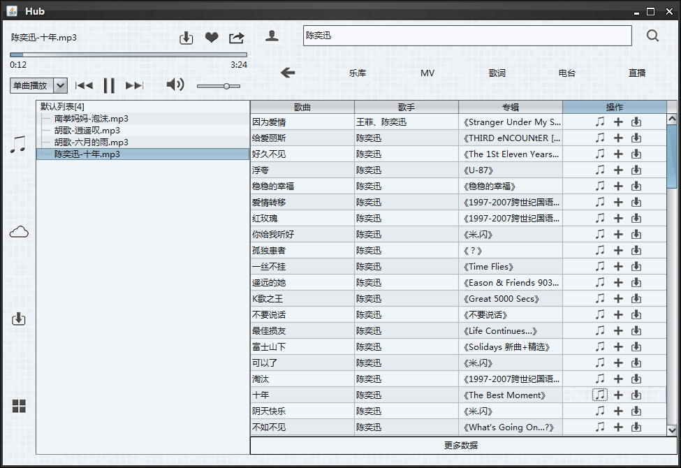

# HubPlayer

以酷狗音乐播放器的用户界面为原型, 一个基于 Java Sound, 实现播放、搜索、下载歌曲的音乐播放器。

此音乐播放器支持音乐格式较少, 只有 MID, WMA, MP3。最后，为音乐播放器置入一些自己和同学写的游戏，增强了一点娱乐性。

## 功能说明

程序启动时, 会在 E盘 创建一个 Hub 文件夹, Hub/SongLibrary.dat 保存了播放器抓取到的歌曲数据, Hub/download 保存了下载的歌曲。

播放器的进度条没有实现跳帧功能。

## 第三方库

Java Zoom: Java Zoom 提供了一个兼容 Java Sound 的纯 Java 解码器，为 Javax.Sound 扩展 MP3 的 SPI 支持库。

Jaudiotagger: 提供一个 Java 类库用于编辑音频文件的 tag 信息。

JSoup: 一款 Java 的 HTML 解析器, 可直接解析某个 URL 地址、HTML 文本内容。

Substance: UI 库

## 时间

2014-12-6
